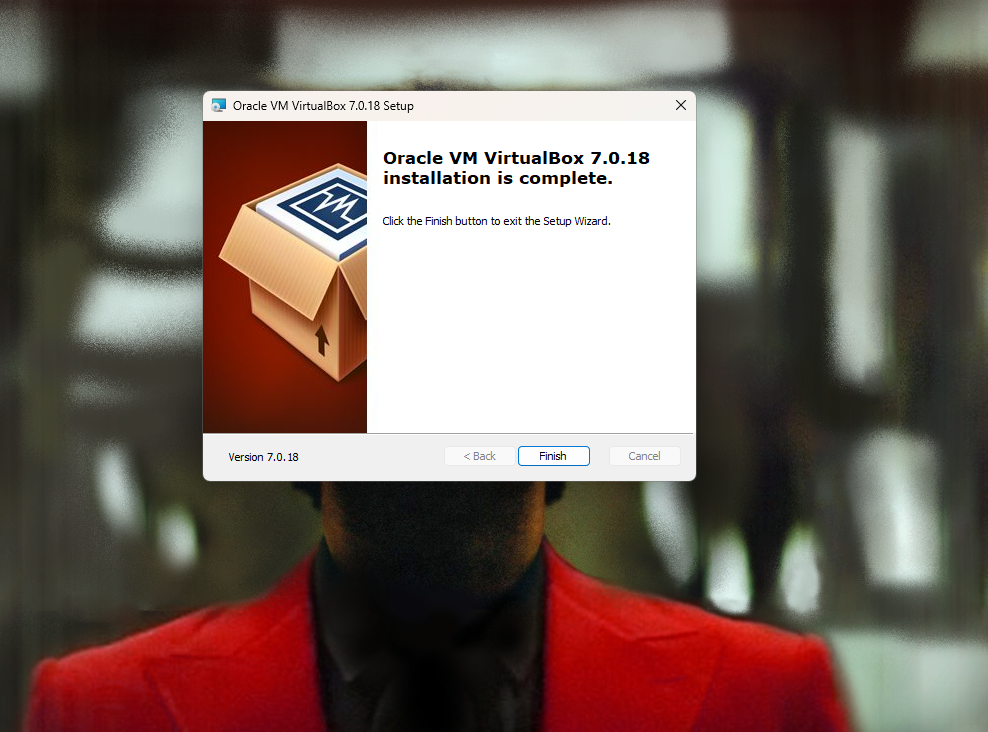

## A New Class of Threats

A new class of threats, dubbed as “Advanced Persistent Threat” (APT), are trained and well-resourced adversaries that target highly sensitive economic, proprietary, or national security information by conducting multi-year intrusion campaigns.

## Flaws in Conventional Incident Response Methods

Conventional incident response methods fail to mitigate the risk posed by APTs because they make two flawed assumptions:
1. Response should happen after the point of compromise.
2. The compromise was the result of a fixable flaw.

## Intelligence-Driven Defense

The paper describes an intelligence-driven, threat-focused approach to study intrusions from the adversary's perspective. This intelligence-driven computer network defense (CND) model incorporates threat-specific intrusion analysis and defensive mitigations.

### Risk Management Approach

This defense is a risk management approach that addresses the threat component of risk, incorporating analysis of adversaries, their capabilities, objectives, doctrine, and limitations. It also represents a new intrusion kill chain model to analyze intrusions and drive defensive actions.

### Indicators of Intrusion

An indicator is any piece of information that objectively describes intrusions. Indicators are categorized as:
- **Atomic**: Cannot be divided further.
- **Computed**: Data involved in an incident.
- **Behavioral**: A collection of computed and atomic indicators.

Analyzing these indicators can lead to identifying new actions and states.

## Intrusion Kill Chain

A kill chain is a systematic process to target and engage an adversary to create desired effects. The steps in the kill chain process are:

1. **Reconnaissance**: Research and identification of targets.
2. **Weaponization**: Exploiting the deliverable payload.
3. **Delivery**: Transmission of the weapon to the targeted environment.
4. **Exploitation**: Targeting an application or operating system's vulnerability.
5. **Installation**: Installing the weapon on the victim.
6. **Command and Control**: Compromised hosts signal outbound to an internet controller server to establish a channel, allowing intruders "hands-on" access inside the environment.
7. **Actions on Objectives**: Collecting, encrypting, and extracting information from the victim.

## Course of Action

The intrusion kill chain model helps organizations enhance their cyber defenses by aligning their security measures with the steps adversaries take during attacks. By using a matrix of actions—detect, deny, disrupt, degrade, deceive, and destroy—defenders can employ various strategies, such as intrusion detection systems and vigilant user behavior, to counteract different attack phases.

The goal is to achieve resilience against persistent threats, including zero-day exploits. Rather than focusing solely on preventing zero-day attacks, organizations should use all available indicators to detect and mitigate repeated attacker tactics. This strategy increases the difficulty and cost for adversaries to succeed, improving the organization's overall defensive posture.

## Intrusion Reconstruction

Kill chain analysis gives analysts insight into cyber attacks by looking at every step, from how they start to how they work. Rather than just reacting after an attack happens, security teams should look at earlier parts to stop future attacks. This approach helps spot and fight back against the tools and methods hackers use making them always change their tactics. Looking at both attacks that work and those that don't lets security teams catch threats earlier in the kill chain. This keeps them one step ahead of the bad guys. This forward-thinking plan makes systems stronger by getting ready for and stopping future threats before they happen.

## Campaign Analysis

Campaign analysis entails the temporal research of several cross-encroachment kill chains to establish resemblances and recurring characteristics across attacks, identifying them as part of a broader threat campaign. Defenders recognize these repetitive indicators and 
develop action plans in anticipation of future attacks.
This methodology aims to analyze the tactics, techniques, and procedures (TTPs) of adversaries, determining how a specific actor operates and what goals they pursue. This allows defenders to evaluate their defense posture, identify vulnerabilities, and strategically plan security measures to protect assets from ongoing threats.

# Technical Report: Installing Debian 12 (Bookworm) on VirtualBox

## 1. Installing and Configuring VirtualBox

### 1.1 Downloading VirtualBox

I visited the [VirtualBox website](https://www.virtualbox.org/).

I navigated to the "Downloads" section, which provided download links for various operating systems.

I selected the appropriate version for my OS. For this report, I used the Windows version and clicked the "Windows hosts" link to download the installer.

### 1.2 Installing VirtualBox

I ran the installer by navigating to the folder where it was downloaded and double-clicking `VirtualBox-<version>-Win.exe`.

I followed the installation wizard:
- Clicked "Next" through the initial setup screens.
- Chose the default installation location and clicked "Next."
- Left the default options selected for shortcuts and file associations.
- Clicked "Next" and then "Yes" to approve network interface warnings.
- Clicked "Install" to start the process.

The installation completed, and I clicked "Finish" to exit the installer. VirtualBox was now installed.

### 1.3 Configuring VirtualBox

I launched VirtualBox by double-clicking the shortcut on my desktop.

I configured the default settings by navigating to `File > Preferences` and checked the settings for general, input, and network options. No changes were needed.

## 2. Setting Up a Debian 12 Virtual Machine

### 2.1 Downloading the Debian 12 ISO

I visited the [Debian website](https://www.debian.org/).

I navigated to the "Getting Debian" section and clicked "Download" to access Debian images.

I selected the Debian 12 (Bookworm) ISO for the `amd64` architecture and downloaded the "netinst" ISO file.

### 2.2 Creating a New Virtual Machine

I clicked "New" in VirtualBox to start the VM creation process.

I named the VM `debian`, set `Type` to Linux, and `Version` to Debian (64-bit).

I allocated `2048 MB` of RAM.

I created a virtual hard disk:
- Selected "Create a virtual hard disk now" and clicked "Create."
- Chose "VDI (VirtualBox Disk Image)" and clicked "Next."
- Selected "Dynamically allocated" and clicked "Next."
- Set the disk size to `20 GB` and clicked "Create."

### 2.3 Configuring Virtual Machine Settings

I opened the VM settings by selecting the Debian 12 VM and clicking "Settings."

I configured the system settings:
- Under the "System" tab, I unchecked "Floppy" and allocated `2 CPUs`.
- Under the "Display" tab, I increased "Video Memory" to `128 MB`.

I added the Debian ISO:
- Under the "Storage" tab, I clicked "Empty" under "Controller: IDE."
- Clicked the disk icon next to "Optical Drive" and selected "Choose a disk file."
- Chose the downloaded Debian 12 ISO file.

I configured network settings:
- Under the "Network" tab, I ensured "Adapter 1" was enabled and attached to "NAT."

I saved the settings by clicking "OK."

## 3. Installing Debian 12 (Bookworm) on the Virtual Machine

### 3.1 Starting the Virtual Machine

I selected the Debian 12 VM and clicked "Start."

The Debian installer booted from the ISO, and the installer screen appeared.

### 3.2 Running the Debian Installer

I selected "Graphical Install" and pressed Enter.

I chose English as the installation language and clicked "Continue."

I selected United States as my location and clicked "Continue."

I configured the keyboard to Finnish and clicked "Continue."

The installer detected the network hardware and loaded necessary drivers.

I configured the network:
- Set the hostname to `debian` and clicked "Continue."
- Left the domain name blank and clicked "Continue."

I set up users and passwords:
- Set the root password and clicked "Continue."
- Created a new user account (`username: user`) and set a password.

I confirmed partitioning and writing changes to the disk by selecting "Yes" and clicking "Continue."

### 3.4 Installing the Base System

The installer proceeded to install the base system packages.

### 3.5 Configuring the Package Manager

I selected United States as the archive mirror country and a default Debian mirror server (e.g., `deb.debian.org`).

I opted not to use a proxy and clicked "Continue."

### 3.6 Installing Additional Software

I chose "No" for the package usage survey and clicked "Continue."

I selected "Debian desktop environment" and "standard system utilities" and clicked "Continue."

The installer downloaded and installed the selected packages.

### 3.7 Installing the GRUB Boot Loader

I selected "Yes" to install the GRUB boot loader to the primary drive (`/dev/sda`) and clicked "Continue."

### 3.8 Finishing the Installation

The installation completed. I clicked "Continue" to reboot the system.

## Sources 
- Hutchins et al 2011: Intelligence-Driven Computer Network Defense Informed by Analysis of Adversary Campaigns and Intrusion Kill Chains.URL:https://lockheedmartin.com/content/dam/lockheed-martin/rms/documents/cyber/LM-White-Paper-Intel-Driven-Defense.pdf
- Ksh Royal: How To Install Debian 12 in VirtualBox | Debian Linux 2023, 13, June,2023.URL:https://www.youtube.com/watch?v=MxIAyAELqu4

